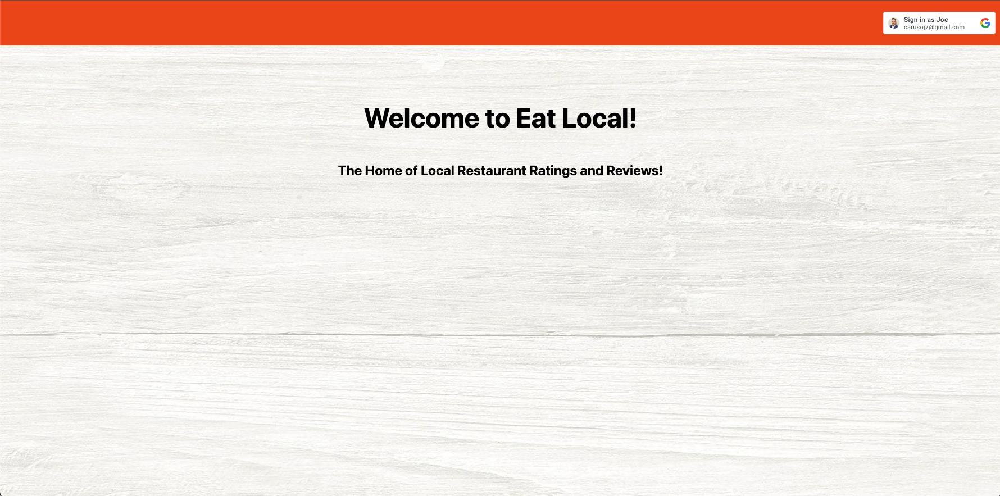

 # **Eat Local**

 

 ## Objective
 Eat Local is a restaurant review-based application where users can view details and reviews of local restaurants. They can also add new restaurants to the list along with their overall experience. 

 ## Visit [Eat Local](https://eat-local-joe-c.fly.dev/)

 ## [Planning Materials](https://trello.com/b/i1IN5qje/eat-local)

 ## Motivation
 I created this application to provide users with a seamless and efficient experience for discovering new restaurants. With going out to eat getting more and more expensive, this application displays a platform to see genuine feedback, as well as gives users an outlet to describe their own experiences. Most importantly, I wanted to prioritize local restaurants to support the small business community.

 ## Technology Implemented:

 * JavaScript
 * CSS
 * HTML
 * GitHub
 * Node.js
 * Express.js
 * MongoDB
 * Docker
 * Google OATH

 ## Credits:

 [Favicon Image](https://stock.adobe.com/search/images?k=%22restaurant+icon%22)

 [Background Image](https://images.app.goo.gl/4PqrYyjyurrMHq4f9)

 [Google Fonts](https://fonts.google.com/specimen/Open+Sans#styles)

 ## Ice Box:

 * Make the application compatible with mobile devices.

 * Add a search bar to search by restaurant name.

 * Filter the restaurants by city or state.